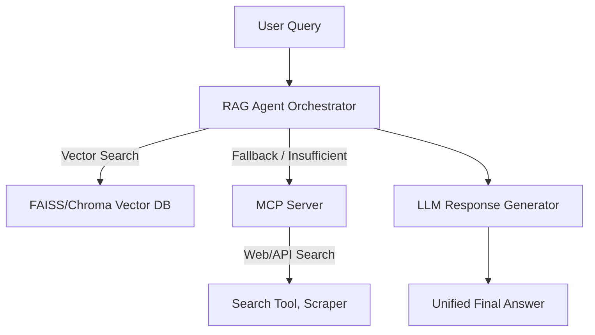

# RAG-MCP Assistant

[](https://www.python.org/) [](https://fastapi.tiangolo.com/) [](./LICENSE) [](https://www.docker.com/) [](https://github.com/your-repo/your-project/actions) [](https://codecov.io/gh/your-repo/your-project) [](./CONTRIBUTING.md) 


## Overview

This repository provides an advanced AI assistant that combines Retrieval-Augmented Generation (RAG) using your own knowledge base with real-time web search. If the answer can’t be found in your local documents, the system seamlessly falls back to web search via an MCP server, integrating both sources for more accurate, on-demand answers.
Key technologies: **LangChain, FAISS, PyTorch, OpenAI, Model Context Protocol (MCP)**.

***

## 🚀 Features

- **Hybrid RAG Pipeline:** Automatically merges local vector search and fresh web/API results.
- **MCP Server Integration:** Calls external tools or web APIs whenever local data is insufficient.
- **Agentic Orchestration:** Decides dynamically between RAG and MCP, using advanced logic.
- **Citations \& Transparency:** Sources for each response clearly indicated.
- **Production-Ready:** Docker deployment, health checks, error handling, and logging.
- **Extensibility:** Easily add new document sources, search tools, or LLM providers.

***

## 🏛️ Architecture



- **Full architecture and component descriptions:** [docs/SYSTEM_DESIGN.md](docs/SYSTEM_DESIGN.md)

***

## 📦 Installation

### Requirements

- Python 3.8+
- OpenAI and/or other LLM API keys
- For web search: [SerpAPI](https://serpapi.com/) or similar


### Clone \& Install

```bash
git clone https://github.com/PranithChowdary/Real-time-web-search-RAG-with-MCP.git
cd Real-time-web-search-RAG-with-MCP
python -m venv venv
source venv/bin/activate
pip install -r requirements.txt
cp .env.example .env
# Add your API keys to .env
```
sample `.env` file can be found at [.env.example](https://github.com/PranithChowdary/Real-time-web-search-RAG-with-MCP/blob/main/.env.example)

### Docker (Optional)

```bash
docker-compose up -d
```


***

## 🚦 Quick Start

Start the MCP server in one terminal:

```bash
python -m src.mcp_server.server
```

In another terminal, run a basic query:

```bash
python examples/basic_usage.py
```

Or launch the CLI demo:

```bash
python examples/cli_demo.py
```


***

## Usage Examples

#### Python

```python
from src.agent.orchestrator import RAGMCPOrchestrator

assistant = RAGMCPOrchestrator()
response = assistant.query("Give me the latest on generative AI agents.")
print(response)
```


#### REST API

Start the API server and POST queries to `/query`.

#### Adding Documents

```python
assistant.add_documents(["my_docs/intro_ai.pdf", "my_docs/ml_basics.txt"])
assistant.update_vector_store()
```


***

## 🛠 Configuration

Configure all API keys, server ports, and model names via the `.env` file. See [docs/DEPLOYMENT.md](docs/DEPLOYMENT.md) for scaling, prod deployments, and security notes.

***

## 📑 Documentation

- **System design:** [docs/SYSTEM_DESIGN.md](docs/SYSTEM_DESIGN.md)
- **API reference:** [docs/API_REFERENCE.md](docs/API_REFERENCE.md)
- **Deployment guide:** [docs/DEPLOYMENT.md](docs/DEPLOYMENT.md)

***

## 🤝 Contributing

Contributions are welcome!

- Fork, create a feature branch, submit pull requests.
- Please add tests for new features and update docs as needed.

***

## 📄 License

MIT License – see [LICENSE](LICENSE) for full text.

***

## Acknowledgments

- [LangChain](https://github.com/langchain-ai/langchain)
- [Model Context Protocol](https://github.com/modelcontextprotocol)
- [OpenAI](https://openai.com)
- [FAISS](https://github.com/facebookresearch/faiss)

***

**If you find this project useful, please star the repo and share your feedback!**

***