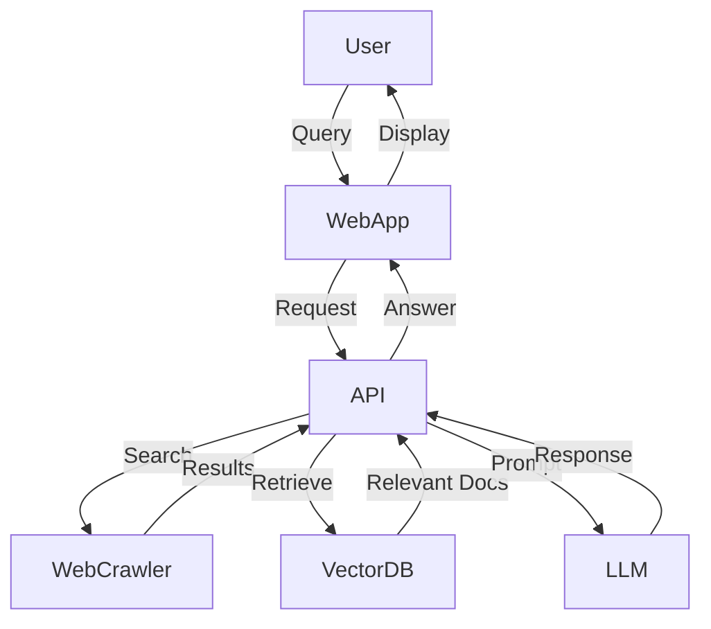

# System Design: Real-time Web Search RAG with MCP

## Overview

This document outlines the system design for a real-time web search Retrieval-Augmented Generation (RAG) application using Microsoft Cloud Platform (MCP).

---

## Architecture Diagram

---

## Components

### 1. Web Application
- Frontend UI for user queries and displaying results.
- Authentication and session management.

### 2. API Layer
- Handles requests from the frontend.
- Orchestrates search, retrieval, and generation.

### 3. Web Crawler
- Fetches real-time web data.
- Cleans and preprocesses content.

### 4. Vector Database
- Stores embeddings of crawled documents.
- Supports similarity search for retrieval.

### 5. Large Language Model (LLM)
- Generates answers using retrieved documents and user query.
- Hosted on MCP (Azure OpenAI, etc.).

---

## Data Flow

1. **User submits a query.**
2. **WebApp** sends the query to the **API**.
3. **API** triggers the **WebCrawler** for real-time data.
4. **WebCrawler** returns processed documents.
5. **API** retrieves relevant documents from **VectorDB**.
6. **API** sends query and context to **LLM**.
7. **LLM** generates a response.
8. **API** returns the answer to the **WebApp**.

---

## Technologies

- **Frontend:** React.js, Next.js
- **Backend/API:** Python (FastAPI), Node.js
- **Web Crawler:** Scrapy, BeautifulSoup
- **Vector Database:** Azure Cognitive Search, Pinecone
- **LLM:** Azure OpenAI Service
- **Deployment:** Azure App Service, Azure Functions

---

## Scalability & Reliability

- Use Azure Load Balancer for API scaling.
- Deploy services in containers (AKS).
- Implement caching for frequent queries.
- Monitor with Azure Monitor and Application Insights.

---

## Security

- Use Azure AD for authentication.
- Encrypt data at rest and in transit.
- Regular vulnerability assessments.

---

## Future Enhancements

- Add user feedback loop for answer quality.
- Integrate more data sources.
- Support multi-language queries.
